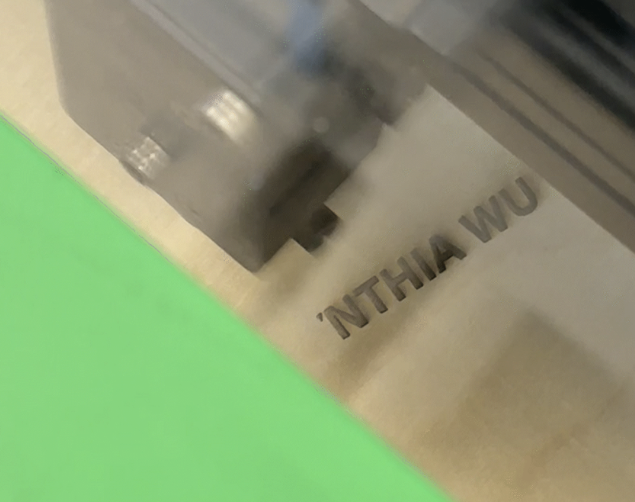

# Report 1 - Week of 08/28/2023 (Week 1)
<h2>Technology Design Foundations</h2>

[//]: # (
)

<h3 style="color: blue;">Summary:</h3>

This week I used computational design **Rhino** files to produce a phone stand.  
First, when I thought about a phone holder I might use, I mainly focus on the **flexibility of angles** to meet different positions, activities and needs.

Here is the process I used laser cutter to print my name.

[//]: # ()

<h3 style="color: blue;">Reflections</h3>

<h3 style="color: blue;">Speculations</h3>

