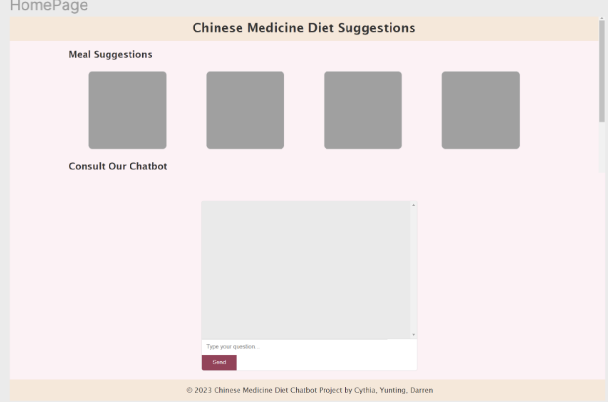
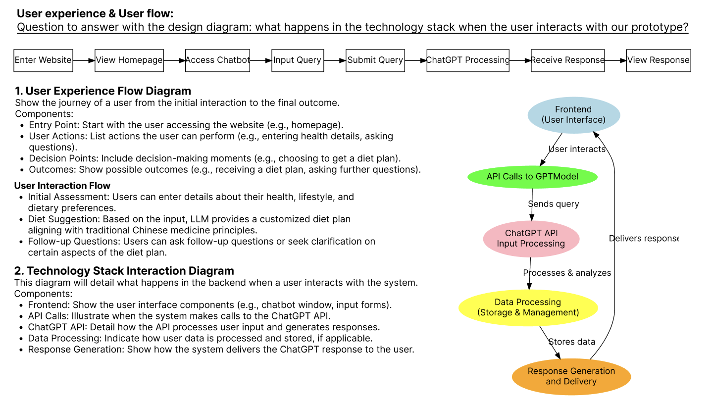
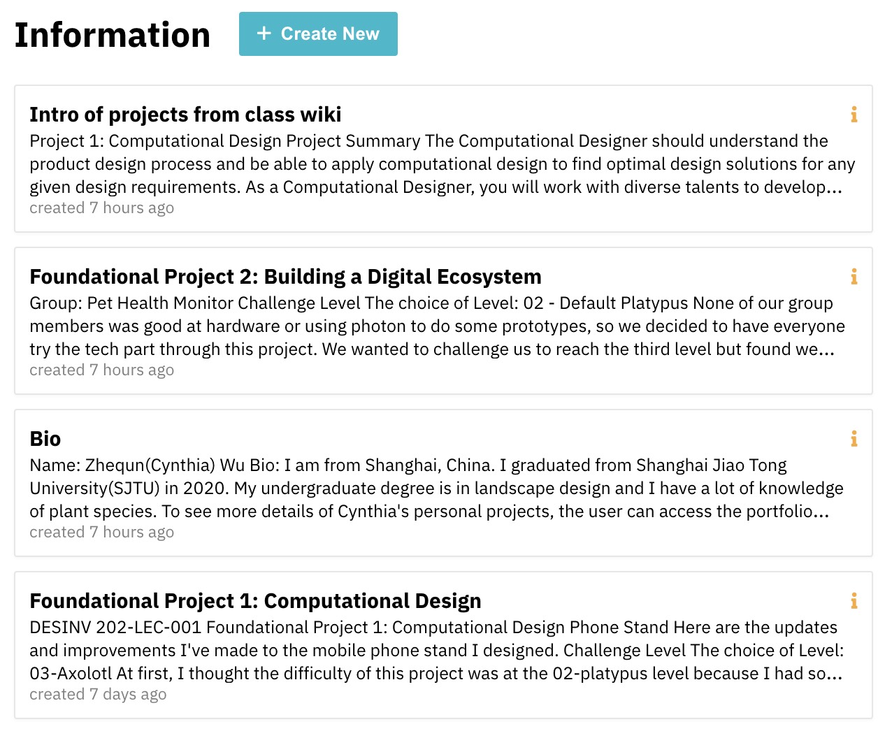
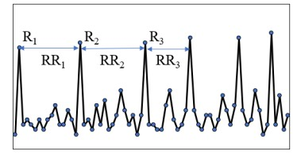
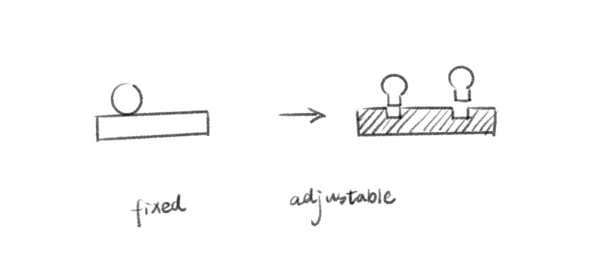
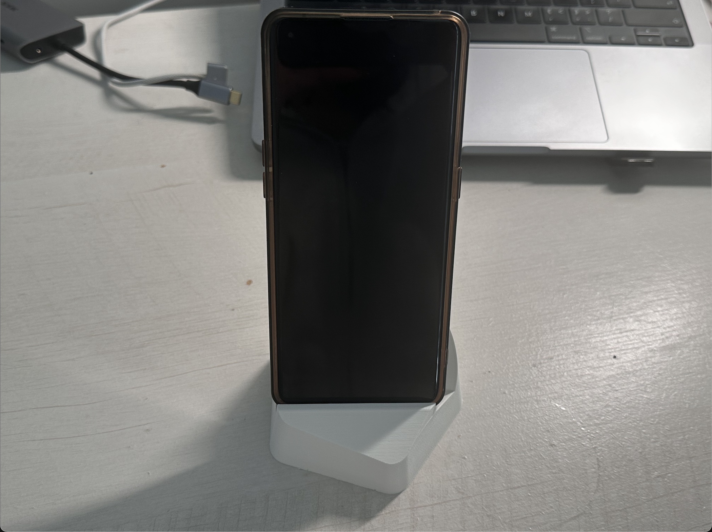
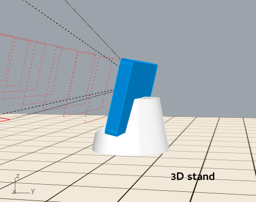

# Report 16 - Week of 12/14/2023 (Week 16)

<h3 style="color: blue;">☆ Summary:</h3> 
This week is the final week, I did a detailed review of the final project and conduct the final report for the project.

<h3 style="color: blue;">☆ Reflections</h3>
From feedbacks of professors, guest visitors and other students, I think our team has some aspects we can improve:

- Some parts of the website are confusing, like right recommendation div, icons need to be more clear for that.
- The chat box can have some sample prompts to instruct users or users can just click to ask sample questions.
- More input and output methods, future application with cutting-edge technologies like DALL-E, to help classify food they have in their home and provide respective recipes.
- Including voice input, as one participant tried to say his question but failed.

<h3 style="color: blue;">☆ Speculations</h3>
The further implement of DALL-E and other technologies can have a huge impact in chatbox.
For the human centric design, we need to consider voice input to bring more convenience to the public.

# Report 15 - Week of 12/07/2023 (Week 15)

<h3 style="color: blue;">☆ Summary:</h3> 
This week, we compiled and translated literature on Chinese medicinal dishes to create our database, which we then integrated into our chatbot. Instead of generating recipe that doesn’t exist, our intelligent system primarily provides information it has in a standardized JSON format.

The code consists of two main parts: a server-side and a frontend-side.

For the server-side, we used Express.js to interact with the ZeroWidth API. It posts the user's message and retrieves the response from ZeroWidth.
The frontend is the user interface, comprising a header with a logo and title, a left container for user input and server output, and a right container for random recommendations.

We also have two key functions:
1. apiCall(), which activates when the user clicks 'submit' or presses 'enter' on their keyboard. The input text is sent to the server to call the ZeroWidth API, and the received JSON-formatted message is rendered in the left response div and the top cute recipe box for a clearer presentation. 
2. recipeGalleryRandomizer(), which populates information from the recipe database randomly when the user refreshes the page or clicks the refresh button. Users can also expand, fold, and unfold the side bar.

The final process is the deploying process. We successfully deploy the static page to serverless platform Vercel to display the final interface.

<h3 style="color: blue;">☆ Reflections</h3>

We also focused on the interactive part of the talking process: the loading interaction and the respective recipe rendering.

<h3 style="color: blue;">☆ Speculations</h3>

It was excited to present the final project to others.

# Report 14 - Week of 11/30/2023 (Week 14)

<h3 style="color: blue;">☆ Summary:</h3> 

This week I collected recipes with Chinese medicine from a bunch of literature and then translated them into English.

After that, we followed the draft ux page and developed a functional website with the tutorial Shm shared with us. The basic function works.

Darren developed the ui and ux for our project. The idea comes from Chinese medicine cabinet.

<h3 style="color: blue;">☆ Reflections</h3>

It's important to split the html pages and script js. The express structure is preset but we need to follow the structure to make the page well-functioned.

<h3 style="color: blue;">☆ Speculations</h3>

Tough to go deeper but I never feel upset. Writing codes are interesting.

# Report 13 - Week of 11/23/2023 (Week 13)

<h3 style="color: blue;">☆ Summary:</h3>

Yunting, Darren and me became one group to take about the user experience flow diagram and technology stack.

We each took a step into what we want to learn through this project and I’m responsible for the model training and frontend development.

I developed MediDish using the ZeroWidth workbench to train a chinese medicine cuisine master, with only some links to websites. I just told it generate recipes based on people’s input, including following points:

<h3 style="color: blue;">☆ Reflections</h3>

The chatbot did generate some recipes with asked format, but when Shm asked us about the accuracy of the data, we decided to do something else to improve it.

<h3 style="color: blue;">☆ Speculations</h3>

We decided to collect database and ask a friend major in chinese medicine for help.

# Report 12 - Week of 11/16/2023 (Week 12)

<h3 style="color: blue;">☆ Summary:</h3> 
This week we start to think about the final project based on previous new technologies and digital platform.

I had two ideas at the beginning. One is creating a professional social assistant that helps create and manage posts for different social platforms. Another is creating a Chinese Medicinal Diet Instructor for individual. After researching, I decided to go for the second idea.

<h3 style="color: blue;">☆ Reflections</h3>
When doing the project, I found there are two things I need to care most:
1. Knowledge Sets for accurate data
2. Instructing prompt to give users the best user experience

**crawl data from http://www.cnzyao.com/shiliao/**

**data in CSV file**

<h3 style="color: blue;">☆ Speculations</h3>

I also tried to customize the instructions on OpenAI GPT.

The answer it generated was also in good form, but I haven't tried to feed any customized datasets.

# Report 11 - Week of 11/09/2023 (Week 11)

<h3 style="color: blue;">☆ Summary:</h3> 

This week, I reviewed the feedback from classmates and finished the reports for the project.

<h3 style="color: blue;">☆ Reflections</h3>

I was asked about some unexpected input during the conversation, like if they don't input numbers I gave.
It's really meaningful to think about different user scenarios and questions that may occur, in order to improve the design.

<h3 style="color: blue;">☆ Speculations</h3>

I started to think about the relationship between AI and human, like the discussion happened last week.

* **Beyond AI/Under AI?**

* How can we decide the relationship between humans and AI? 
* Who decide and How it’s decided?

It’s the instances that AI is used to assist decision-making, automate processes, or provide intelligent services within specific contexts or domains. AI can be beneficial as a tool to enhance human capabilities and improve various aspects of life.

But, how standards, regulations are set and established for AI’s development and how to control it should be considered.

Instead of being AI-dominated or AI-assistant, how to be the master of AI is what people need to think about. The whole process of setting goals to AI, how to judge the performance of AI, the whole algorithm are what we need to think about in the future, which is also things I want to do in the future.

# Report 10 - Week of 11/02/2023 (Week 10)

<h3 style="color: blue;">☆ Summary:</h3> 

This week, I developed my MINI MEI using the ZeroWidth workbench to construct a knowledge interface that mimics my knowledge base and the projects created during the TDF course.

<h3 style="color: blue;">☆ Reflections</h3>
After reviewing my course works and weekly reports, I selected the knowledge inputs, including personal information, course descriptions, and project details.

Through various tests, I found that the token limit is around 8000 to ensure system efficiency and prevent misuse. Additionally, I adjusted the temperature value to generate more accurate personal information.

<h3 style="color: blue;">☆ Speculations</h3>

I also tried to use the provided API to create an interface with React.js but faced a CORS (Cross-Origin Resource Sharing) issue. Hope I can fix it later.

I believe in the future, the development of personalized large-scale predictive models can further improve the interpersonal interaction experience and promote personalized services. The integration of multimodality can also make artificial intelligence algorithms more human-like.

# Report 9 - Week of 10/26/2023 (Week 9)

<h3 style="color: blue;">☆ Summary:</h3> 

This week, we were taught how to use ZeroWidth to create Ai assistant for ourselvew.

The steps/settings for an innovative agency
1. Creating Intelligence
2. Adding Instructors 
3. Adding Inserted Variables use ${STUDENT_NAME}
4. Creating knowledge sets
5. Connect instructor to the knowledge sets use ${KNOWLEDGE}

<h3 style="color: blue;">☆ Reflections</h3>
From last week project review and peer feedback, I learnt a lot from our classmates' works and comments.  

There are some important options:

Tokens - limited/restricted and represent currency

Retrieval Methods: creating second agent for knowledge options.

<h3 style="color: blue;">☆ Speculations</h3>

The LLM is very powerful. It can help navigate from text dynamically.
It's my first time to create an AI interface/ agent and it's really excited to explore it in the future.

# Report 8 - Week of 10/19/2023 (Week 8)

<h3 style="color: blue;">☆ Summary:</h3> 
This week we focused on how to connect two photons.
Setting two photons to one account was the most difficult part during the process because of some unexpected errors. 

 

After that, we connected our pulse sensor with publish sensor, vibration motor and OLED display with subscribe sensor. Basically, one serves as input from the pet and another serves as output to send information to the pet's owner.

 
 

<h3 style="color: blue;">☆ Reflections</h3>

Although we just got the number of BPM from the pulse sensor to show on the screen, I think we can do more to set up the baseline of pets, such as dogs.

Reference I found is **Stress Monitoring System Based On Heart Rate
Variability Of Dog** *(Chi, Jeong Hee et al. “Stress Monitoring System Based On Heart Rate Variability Of Dog.” International Journal of Scientific & Technology Research 9 (2020): 3732-3736.)*

<h3 style="color: blue;">☆ Speculations</h3>

Our original plan was an AI-based pet wearable, which I thought we could combine machine learning, like **sound classification model** (such as *Recognition of Emotional Vocalizations of Canine* [DOI: 10.3813/AAA.919173](https://www.researchgate.net/publication/323610432_Recognition_of_Emotional_Vocalizations_of_Canine)), **animal poses recognition model** (such as *Recognition of Emotional Vocalizations of Canine* https://doi.org/10.3390/computers11010002).

In the future, more sensors can be added into our prototypes, like temperature sensor, sound sensor, camera to better understand pets' health condition.

 

# Report 7 - Week of 10/12/2023 (Week 7)

<h3 style="color: blue;">☆ Summary:</h3> 
Based on the discussion from last week, each of our group decided to focus on one sensor or mentor this week. My exploration is on vibration motor.

 

<h3 style="color: blue;">☆ Reflections</h3>

The vibration sensor is not difficult but the key point is how to connect the DRV2605L breakout board/2N3904 NPN transistor with the motor instead of connecting motor to sensor directly, which may break the photon.

Thanks to Chris, Shm and Gary, who gave me great support to understand the basic knowledge of the circuit, transistor, and how to use multimeter to test the well-function of the circuit.

It was really interesting to know the fundamental knowledge of electrics and different methods to build a circuit with the same function.

<h3 style="color: blue;">☆ Speculations</h3>
 Looking forward to the further development of connect inputs with outputs in the following weeks.

 

# Report 6 - Week of 10/05/2023 (Week 6)

<h3 style="color: blue;">☆ Summary:</h3> 
This week we had a basic understanding of amazing particle anf edge AI kits.
Besides, with a new group 'how to education pets with AI tools', we did some researches and then had some discussion about our ideas.

<h3 style="color: blue;">☆ Reflections</h3>

We had three ideas and voted for them, then dig deeper into the pet wearables using biosensors.
I'm really glad I can have the opportunity to work on topic I am mostly interested in in Project2.

<h3 style="color: blue;">☆ Speculations</h3>
I was impressed by the huge potential of the Photon2 and AI kits after watching so many examples. Can't wait to develop my idea with them!

 

# Report 5 - Week of 09/28/2023 (Week 5)

<h3 style="color: blue;">☆ Summary:</h3> 
This week we took a tutorial class for Particle- Photon2.

-> Hello world

-> Blink an LED
PinMode(internal D7 + external D17 + LDR sensor)

    SYSTEM_THREAD(ENABLED);
    const pin_t MY_LED_int = D7; // internal LED
    const pin_t MY_LED_ext = D17; // external LED
    const pin_t SENSOR_PIN = A1; // LDR sensor
    int analogvalue;

    void setup() {
        pinMode(MY_LED_int, OUTPUT);
        pinMode(MY_LED_ext, OUTPUT); 
        pinMode(SENSOR_PIN, INPUT);
    }

    void loop() {
	    analogvalue = analogRead(SENSOR_PIN); //
        Serial.print(analogvalue);
	    delay(100ms);
        
        //1500 and 1000 were used as two threshold values.
        if(analogvalue <= 1500){ 
            digitalWrite(MY_LED_ext, HIGH);
        }else if(analogvalue <= 1000){
            digitalWrite(MY_LED_int, HIGH);
        }else{
            digitalWrite(MY_LED_ext, LOW);
            digitalWrite(MY_LED_int, LOW);
        }
    }

<h3 style="color: blue;">☆ Reflections</h3>

It's very interesting to write code on webIDE for the first time. We utilized WIFI kits, such as internal and external LEDs, LDR sensor to obtain different analog signal values as light intensity changes. Using if/else statements to assess the light level and thus control the LED's on/off status demonstrates the system's contextual relationship.

I really enjoyed idea generation session - education? for? how?. I loved the ideas of programming/pet/media literacy education.
 

<h3 style="color: blue;">☆ Speculations</h3>
Guest speaker Adrian Freed discussed his innovative approach of utilizing fabrics to create conductive materials and establish complete circuits, which was truly inspirational. By challenging conventional methodologies, he achieved a breakthrough, demonstrating the immense value of a multidisciplinary approach.  

# Report 4 - Week of 09/21/2023 (Week 4)

<h3 style="color: blue;">☆ Summary:</h3> 

In this week, we finished the project1 and start the second project about **The Digital Ecosystem**. Following Sudhu's Photon2 tutorial, I had my Photon set, connect to Wi-Fi, got my Mac address and create a Berkeley-Lot account.

• Verify the code:

• Flash to the device:

• Look at the **Serial.printf( )** information using USB serial debug log:

<h3 style="color: blue;">☆ Reflections</h3>

It was quite challenging to connect it with both wifi and usb serial. I have tried both the website and the terminal, I can detect the wifi with my local particle-cli while I failed most of the time when using the Web IDE.

Fortunately, I finished it and changes of the light were interesting when testing different setting modes. 

<h3 style="color: blue;">☆ Speculations</h3>
I really want to learn more about different sensors through the learning process.

# Report 3 - Week of 09/14/2023 (Week 3)

<h3 style="color: blue;">☆ Summary:</h3> 
This week I redesigned my phone stand based on my favorite chair. 

Here's my concept design.  

Design printed.  

<h3 style="color: blue;">☆ Reflections</h3>
My original design cannot be realized for lack of support.  
 

 
So I redesigned it.  
 

 
Due to the high temperatures and material melting in 3D printing, which can result in inaccuracies, it is necessary to polish the injected parts. Additionally, to reduce errors, small-scale tests can be conducted. Therefore, chamfers should be left for future reference.
 

 
It can also be used as another decoration on my desk.
 

<h3 style="color: blue;">☆ Speculations</h3>
Combining design ideas with computational design into a system can reduce design time. I believe that future developments will involve collaborating with artificial intelligence to achieve parametric design and utilizing artificial intelligence to automatically generate designs.

 
 
 

# Report 2 - Week of 09/07/2023 (Week 2)

<h3 style="color: blue;">☆ Summary:</h3>

This week I learned **laser cutter** and  **3d printer** on Thursday class. 

As I have customized the assembly laser cutting last week, I tried to reshape the model using rhino and redesign the solid phone stand.
The whole design shape is asymmetrical since I used **pentagon** as the base shape. 

 

Then I used 3d printer(Prusa i3 MK3/MK3s) to print the phone stand.

 
 

 

<h3 style="color: blue;">☆ Reflections</h3>

<li>Rhino</li>

&nbsp;&nbsp;&nbsp;&nbsp; I added new components in the given grasshopper file, which I failed to do last week. I felt it difficulty but interesting reconnecting the whole system when changing the first several inputs.

 

<li>Cura</li>

&nbsp;&nbsp;&nbsp;&nbsp; Following the instruction on the tutorial, I still had questions about the important considerations until real-hand practice. It was fascinating to learn that I can also change the infill pattern to **Gyroid** to make the product more stable and time-saving.

 

<h3 style="color: blue;">☆ Speculations</h3>
I utilized grasshopper to modify several key parameters in our design system. I think that these parameter adjustments may lead to improved structural stability in our designs. Besides, there is a possibility that the changes in Ultimaker-Cura setting could optimize the overall efficiency when producing. To validate these speculations, further testing and analysis will be necessary.

 
 
 
 

# Report 1 - Week of 08/28/2023 (Week 1)

<h3 style="color: blue;">☆ Summary:</h3>

This week I used computational design **Rhino** files to produce a phone stand.  
First, when I thought about a phone holder I might use, I mainly focus on the **flexibility of angles** to meet different positions, activities and needs.

Here is the process I used laser cutter to print my name. 

[//]: # (&#40;or Click image to see the process&#41;)

[//]: # ([![Cat GIF]&#40;images/week1/lasercutter.png&#41;]&#40;https://drive.google.com/file/d/1d7FUXFVWCkc5_F7aKFeP6bSoskS8gJOo/view?usp=sharing&#41;)

And then I got my final product with wood material.

<h3 style="color: blue;">☆ Reflections</h3>

I spent a lot of time learning the grasshopper file, but I haven't successfully reached each of my expectations in Rhino before doing my final physical work.
 

 
<h4>Here are some of my reflections for this project.</h4>

<ol>
<li>Measure and adjust according to your own situation before and when working on each section. 
<ul>
<li>design with measurements: phone size, student height, distance between student and table, etc.</li>
<li>operating with calipers: thickness of material </li>
</ul>
</li>
 
 
Here are some of my attempts. Properties of the phone have the greatest impact on the holder, especially the tilt angle, while the influence of other factors is relatively minor. 
 

 
 

<li>Visualizing attributes to help adjustment. 
<ul>
<li>Students' activities</li>
<li>Students' sight to the screen</li>
<li>Camera view intersection with the table</li>
</ul>
</li>
When viewing angle exceeds the max/min angle, I can observe clearly.

 
I am not sure why it did not run into a problem(to visualize the error).

</ol>

<h3 style="color: blue;">☆ Speculations</h3>
I believe that using Rhino and Grasshopper to design a phone stand, followed by laser cutting and 3D printing for manufacturing, demonstrates the integration of computational design tools with precision fabrication methods. Crafting a personalized phone stand based on individual needs is intriguing, and I intend to continue using these methods. In the future, these tools will likely become even more tightly integrated, offering a broader range of materials to choose from, such as flexible, eco-friendly, or even 4D printing materials to replace laser cutting.

